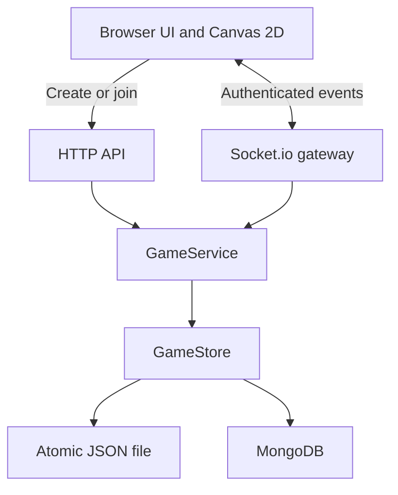

# Architecture

Tavern uses Next.js App Router and a custom, long-running Node server. One process owns HTTP, Socket.io, authoritative game state, and persistence.

## Responsibilities

`server.ts` loads storage, prepares Next.js, dispatches the API, and attaches Socket.io. HTTP is handled by this custom server, rather than Next.js route handlers. Shared TypeScript interfaces and Zod schemas define inputs.

`GameService` owns bounds, room ownership, GM authorization, and mutations. It serializes mutations through a promise queue: clone state, validate/apply, persist, then publish. A failed write does not publish an unconfirmed change in memory.

The gateway joins sockets to `room:<UUID>` and broadcasts within that room. Presence is derived from active sockets and deduplicated by participant. Scene operations send personalized snapshots: public room, scene summaries, active tiles, members, and recipient identity.

## Sessions and permissions

- Create generates a GM session and a random 256-bit private token. Join creates a player session.
- Browser local storage retains the credential for refresh/reconnect. The server stores its SHA-256 hash and compares hashes in constant time.
- Joining from a browser with a saved session authenticates and restores that seat. Invalid saved credentials can only create a new player session; an ordinary join can never replace a valid GM seat.
- The handshake role is untrusted. Persisted membership and the room's `gmId` determine editing rights.
- All tile and scene mutations validate room ownership and GM permission server-side.
- Shared snapshots omit tokens, hashes, and `gmId`. Invite links contain only the room code.

No accounts, token expiry, recovery, or GM transfer exist yet. Losing the creator's browser data loses GM access. Codes are intended for invited friends. Production requires HTTPS for credentials and clipboard access.

## Contracts

| HTTP route             | Result                                                                                                          |
| ---------------------- | --------------------------------------------------------------------------------------------------------------- |
| `GET /api/health`      | Readiness and storage mode                                                                                      |
| `POST /api/rooms`      | Create from `{ name, nickname, template }`; return GM credential                                                |
| `POST /api/rooms/join` | Join from `{ code, nickname, session? }`; restore an authenticated saved seat or return a new player credential |

HTTP writes require JSON, check browser origin when supplied, cap input size, and rate-limit the remote IP. A proxy's IP is shared unless individual client addresses are separately handled. Socket authentication uses `{ roomCode, memberId, token }`.

| Client event   | Payload                                | Broadcast       |
| -------------- | -------------------------------------- | --------------- |
| `tile:paint`   | `{ panelId, tiles }`, at most 64 tiles | `tile:updated`  |
| `panel:change` | Panel UUID                             | `room:snapshot` |
| `panel:create` | `{ name, cols, rows, template }`       | `room:snapshot` |
| `panel:rename` | `{ panelId, name }`                    | `room:snapshot` |
| `panel:import` | Version 1 exported map                 | `room:snapshot` |

Acknowledgements use `{ ok: true, data }` or `{ ok: false, error }`. The gateway limits a socket to 80 actions/second and 512 KB messages. The browser batches paint over 35 ms, displays confirmed changes, and reconnects with a fresh snapshot. Editing is disabled when disconnected; queued, unconfirmed paint is cleared.

## Rendering and UI

Canvas 2D generates original pixel terrain at 32 px per tile. Missing coordinates are empty. An offscreen canvas caches terrain, grid, and optional collision overlays. The visible canvas draws that world and brush preview through coalesced animation frames, with pan/zoom, responsive sizing, capped device pixel ratio, and disabled interpolation.

React, local CSS with Tailwind available, and Lucide provide the interface. No paid generation API or external terrain art is required. Primary interactions include native dialogs, visible focus, keyboard map controls, reduced motion, and a mobile scene drawer.

Typography pairs Pixelify Sans for the brand and display headings with DM Sans for body copy and controls. Variable Latin WOFF2 files (including Portuguese accents) live in `src/app/fonts/`, alongside their SIL Open Font Licenses, and load through `next/font/local`. Both development and production builds work without fetching fonts from an external service. Tailwind's `font-display` and `font-sans` utilities expose the same families used by the local CSS.

## Persistence boundaries

`GameStore` exposes `load`, `save`, and optional `close`. `FileStore` atomically replaces the complete JSON dataset. `MongoStore` loads three collections and replaces changed documents, saving panels before sessions and room pointers.

MongoDB changes are not a multi-document transaction. Interrupted writes can leave orphan records or a partially applied operation on disk; confirmation is sent only after all writes succeed. There is no deletion flow.

Both adapters require **one application process and one writer**. All rooms and inactive panels are cached in memory; clients receive only active-panel tiles. Incremental database writes, transactional recovery, archival, and multi-instance coordination are future work. Use persistent Node hosting with WebSocket support, rather than serverless or static export.
