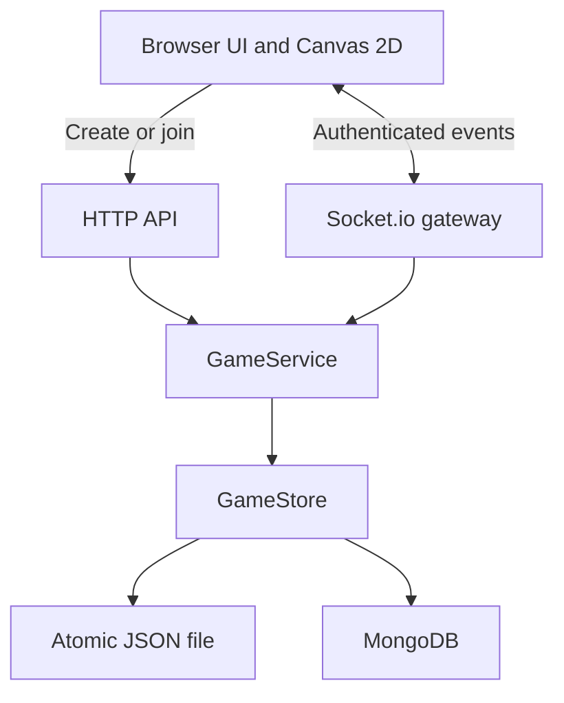

# Architecture

Tavern uses Next.js App Router and a custom, long-running Node server. One process owns HTTP, Socket.io, authoritative game state, and persistence.

This document describes current behavior. [ADR 0001](adr/0001-phase-4-gm-coordination.md) records why the initial phase 4 character/movement model changed and which follow-up requests expanded its scope. See the [decision index](adr/README.md) for historical records.

## Responsibilities

`server.ts` loads storage, prepares Next.js, dispatches the API, and attaches Socket.io. HTTP is handled by this custom server, rather than Next.js route handlers. Shared TypeScript interfaces and Zod schemas define inputs.

`GameService` owns bounds, room ownership, GM authorization, and mutations. It serializes mutations through a promise queue: clone state, validate/apply, persist, then publish. A failed write does not publish an unconfirmed change in memory.

The gateway joins sockets to `room:<UUID>` and broadcasts within that room. Presence is derived from active sockets and deduplicated by participant, while character data comes from current persisted sessions. Scene operations send personalized snapshots: public room, scene summaries, visible active tiles, visible member tokens, recipient identity, and dice history.

## Sessions and permissions

- Create generates a GM session and a random 256-bit private token. Join creates a player session.
- Browser local storage retains the credential for refresh/reconnect. The server stores its SHA-256 hash and compares hashes in constant time.
- Joining from a browser with a saved session authenticates and restores that seat. Invalid saved credentials can only create a new player session; an ordinary join can never replace a valid GM seat.
- The handshake role is untrusted. Persisted membership and the room's `gmId` determine editing rights.
- All tile and scene mutations validate room ownership and GM permission server-side.
- Health mutations resolve the actor's persisted session inside the mutation queue. Players adjust their own current HP; only the room GM changes another player's HP or maximum bonus. Targets must be players in the same room. Health clamps to its class/subclass/GM maximum and persists before broadcast; failed writes leave confirmed HP unchanged.
- Only players customize characters; the GM has no character/token. GameService assigns player spawns near a per-scene preferred point (row-major fallback), and enforces room movement permission, one-step player movement, active scene ownership, collision, occupancy and player fog visibility. The GM can reposition same-room players at any valid free tile, even while paused or behind fog. Legacy GM character/token fields are discarded on load.
- Fog is GM controlled and filtered server-side. Hidden terrain/sprites and other hidden positions never enter a player's snapshots, presence, or movement broadcasts. Fogged tile edits use personalized snapshots.
- Shared snapshots omit tokens, hashes, and `gmId`. Invite links contain only the room code.

No accounts, token expiry, recovery, or GM transfer exist yet. Losing the creator's browser data loses GM access. Codes are intended for invited friends. Production requires HTTPS for credentials and clipboard access.

## Contracts

| HTTP route             | Result                                                                                                          |
| ---------------------- | --------------------------------------------------------------------------------------------------------------- |
| `GET /api/health`      | Readiness and storage mode                                                                                      |
| `POST /api/rooms`      | Create from `{ name, nickname, template, classes? }`; return GM credential                                      |
| `POST /api/rooms/join` | Join from `{ code, nickname, session? }`; restore an authenticated saved seat or return a new player credential |

HTTP writes require JSON, check browser origin when supplied, cap input size at 32 KB, and rate-limit the remote IP. A proxy's IP is shared unless individual client addresses are separately handled. Socket authentication uses `{ roomCode, memberId, token }`.

| Client event       | Payload                                          | Broadcast        |
| ------------------ | ------------------------------------------------ | ---------------- |
| `tile:paint`       | `{ panelId, tiles }`, at most 64 tiles           | `tile:updated`   |
| `panel:change`     | Panel UUID                                       | `room:snapshot`  |
| `panel:create`     | `{ name, cols, rows, template }`                 | `room:snapshot`  |
| `panel:rename`     | `{ panelId, name }`                              | `room:snapshot`  |
| `panel:import`     | Version 1 exported map                           | `room:snapshot`  |
| `character:update` | `CharacterAppearance`                            | `room:presence`  |
| `health:update`    | `{ memberId?, current?, delta?, gmBonus? }`      | `health:updated` |
| `room:movement`    | `{ allowed }`                                    | `room:snapshot`  |
| `room:classes`     | `{ classes }`, validated room catalog            | `room:snapshot`  |
| `panel:spawn`      | `{ panelId, point: { x, y } or null }`           | `room:snapshot`  |
| `token:move`       | `{ x, y, panelId, memberId? }`                   | `token:moved`    |
| `dice:roll`        | `{ sides, count, modifier, attribute?, label? }` | `dice:rolled`    |
| `fog:update`       | `{ panelId, enabled? , revealed?, cells? }`      | `room:snapshot`  |
| `panel:duplicate`  | Panel UUID                                       | `room:snapshot`  |
| `panel:remove`     | Panel UUID                                       | `room:snapshot`  |
| `panel:reorder`    | Ordered array of every panel UUID                | `room:snapshot`  |

Acknowledgements use `{ ok: true, data }` or `{ ok: false, error, code? }`. Ordinary movement refusals use `MOVE_REJECTED` and are silent in the UI; authorization, validation, connection and persistence failures remain visible. The gateway limits a socket to 80 actions/second and 512 KB incoming messages. The browser batches paint over 35 ms, sends fog strokes in sequential batches of 64 cells, displays confirmed changes, and reconnects with a fresh snapshot. Editing and movement are disabled when disconnected; queued, unconfirmed paint is cleared. Character changes publish both presence and snapshots. Movement broadcasts are personalized, with hidden positions omitted.

## Rendering and UI

Canvas 2D generates original pixel terrain and modular player character sprites at 32 px per tile. Missing coordinates are empty. An offscreen canvas caches terrain, grid, and optional collision overlays. The visible canvas draws that world, brush preview, and active player tokens through coalesced animation frames, with pan/zoom, responsive sizing, capped device pixel ratio, and disabled interpolation.

Tokens move tile-by-tile via WASD/Arrow keys, adjacent clicks, one-step drops, and direction buttons. The GM coordinates without a token, can pause/resume player movement, selects players in the party or on the map to reposition them, and sets/clears a preferred spawn per scene. Empty/full maps keep a saved character without a token until painting makes a free tile available. All movement renders confirmed state; client prediction is deferred. First-time players in a room encounter the character creation gate before tabletop access; the GM opens the tabletop directly. See [characters & tokens](characters.md).

Appearance and other form selects use the shadcn/Radix Select adapted to the Tavern palette, with form values and keyboard controls. Select menus portal into their nearest native dialog so they remain in its modal top layer. Map shortcuts ignore form controls and select menus.

The canvas fills the map workspace. Its toolbar, character/GM status stack, terrain palette, and player note float above it; non-interactive text and gaps pass pointer events to the map, while buttons remain clickable. Initial and explicit Fit measure overlay clearance. Switching tools preserves the camera, and subsequent non-zero container resizes preserve zoom and the world point at the viewport center. Changing scenes mounts a fresh canvas and fits that scene. Right- or middle-button drag pans with every tool, without painting, moving/selecting tokens, setting spawn, or changing fog. Canvas context menus are suppressed. See the [map editor UX plan](map_editor_ux_plan.md).

Terrain adds sand, snow, and flowers to the original palette. Optional local PNG sprites are normalized to 32×32, validated and stored inline on tiles, and cached by the renderer. Server-side fog redaction and canvas shading share the per-scene revealed coordinate set.

The dice log occupies a 280px right sidebar, open by default at widths of 980px or more; the toolbar can close it to expand the canvas. Below 980px it becomes an initially closed native modal drawer with an expression input, contained keyboard focus, and close/Escape/backdrop dismissal. The input parses `XdY`, `dY`, and signed modifiers for d4/d6/d8/d10/d12/d20, with 1–20 dice and modifiers from -1000 to +1000; six quick buttons immediately roll one die. The existing server also accepts d100 for compatibility. Both roles share the last 20 rolls, including nicknames, persisted author roles, timestamps, formulas, faces, totals, and natural d20 highlights. Legacy roles are inferred when producing snapshots, so offline authors retain their badges.

Each newly received `dice:rolled` event starts an independent 800ms SVG/CSS mini-animation, followed by the authoritative server values and a short settle effect. Cycling faces are decorative; the client never chooses an outcome. Snapshot history and reopening the log do not restart animations, simultaneous rolls remain independent, and reduced motion displays the confirmed result immediately. There is no new animation dependency. See the [dice system plan](dice_system_plan.md) for scope and validation.

Each room owns a class catalog, initialized with Guerreiro, Mago, Bárbaro, and Arqueiro unless a configured catalog is supplied at creation. Missing legacy catalogs receive independent default copies on load; explicitly empty catalogs stay empty. The GM edits classes, subclasses, modifiers, and descriptive buff/debuff traits in a staged modal, both from the create-table form and live navigation. Saving validates and persists the catalog before personalized snapshots and presence updates. Deleted selections are cleared from online and offline room characters without changing appearance, tokens, or old dice results.

Player onboarding starts with class cards showing lore, signed modifier badges, and narrative traits, then optional specialization cards and an appearance step. Native radio groups support keyboard selection; Back preserves both appearance and class choices. “No class” keeps freeform characters available, and empty catalogs go straight to appearance. Character editing uses keyboard-accessible Appearance and Class & Specialization tabs. Party rows and the player's HUD resolve class/subclass titles from the current room catalog, so renames and deletions appear live. See the [class selection plan](class_selection_plan.md).

The character summary shows summed modifiers and inherited traits. Players with a valid class have six attribute-check buttons in the dice log. An attribute request uses one d20; GameService derives its bonus and canonical test label from the current persisted character and catalog, overriding client values. Rolls persist the applied bonus, attribute ID, and label so later class edits cannot rewrite history. Traits remain narrative descriptions. Equipment and combat automation are outside this phase. See the [attribute system plan](attribute_system_plan.md).

React, local CSS with Tailwind available, and Lucide provide the interface. No paid generation API or external terrain art is required. Primary interactions include native dialogs, visible focus, keyboard map controls, reduced motion, and a mobile scene drawer.

Typography pairs Pixelify Sans for the brand and display headings with DM Sans for body copy and controls. Variable Latin WOFF2 files (including Portuguese accents) live in `src/app/fonts/`, alongside their SIL Open Font Licenses, and load through `next/font/local`. Both development and production builds work without fetching fonts from an external service. Tailwind's `font-display` and `font-sans` utilities expose the same families used by the local CSS.

Health is part of persisted player sessions and public member state. Unconfigured player sessions start at 20/20 HP. The first character save starts at full effective maximum HP, including class/subclass modifiers and any GM bonus, even when waiting for a free map tile. Later catalog and character changes recalculate HP without healing. Load-time migration initializes legacy player health and removes GM health; the next successful mutation saves these changes. See [health data contracts](data-models.md#character-health) and the [health system plan](health_system_plan.md).

The `health:update` gateway persists the authoritative adjustment, emits room-scoped `health:updated` with `{ memberId, health }`, then refreshes personalized snapshots and presence. The client updates both `snapshot.members` and `snapshot.you`, so sidebar, HUD and token bars render the same confirmed HP. Reconnect restores it from storage. Fog hides positions as before; public health does not expose hidden coordinates.

Player tokens show a 24×3 pixel bar above their nameplate: green above half health, amber from one-quarter through one-half, red below one-quarter, and a KO marker at zero. Party rows and the floating HUD show numeric HP, a proportional meter and a textual unconscious status. The existing native dialog provides quick deltas, damage/healing amounts for players, and exact HP, full healing and maximum bonuses for the GM. It restores focus to the opening control after closing. Controls disable while disconnected or saving; health meters respect reduced motion. The GM's selected-player HUD also offers ±1 HP actions. Class cards and summaries preview base/class/subclass maximum HP, and the class manager edits both modifiers. HP is manual bookkeeping; zero does not pause movement or add combat automation.

## Internationalization

`next-intl` resolves each request from a supported `NEXT_LOCALE` cookie, then quality-weighted `Accept-Language` preferences, then English. Portuguese regional variants use `pt-BR`, and Spanish and English regional variants use `es` and `en`. The root layout provides the selected message catalog and updates HTML language, metadata, and accessibility copy. Routes retain `/`, `/room/[code]`, and `/?join=[code]`; no locale routing middleware intercepts the custom HTTP API or Socket.io.

The shared Radix language select lives in the Hub, character onboarding, desktop table header, and mobile scene sidebar. It stores a one-year, path-wide, SameSite=Lax cookie and a browser-local recovery preference, then refreshes server content without remounting the table, resetting form drafts/camera state, or reconnecting its socket. Browser storage failures do not prevent cookie-based switching. Locale never enters room snapshots or persisted game state.

Message catalogs live in `messages/en.json`, `messages/pt-BR.json`, and `messages/es.json`. Default class/subclass names, descriptions, and traits translate only when the stored field matches its canonical preset. The class editor stages canonical data while displaying translations, so saving a modifier does not replace names or narrative text with the GM's language. Custom catalog prose, nicknames, room/scene names, and ordinary dice labels remain unchanged. Attribute checks render from stable attribute IDs and retain their original bonuses and canonical saved labels. Dice timestamps use localized formatting in UTC. Known API and validation errors translate at the UI boundary without changing backend contracts.

Catalog tests verify recursive key and interpolation parity, nonempty messages, locale fallback, unchanged custom fields, and canonical errors. Browser tests exercise independent participant languages, cookie/recovery behavior, preserved drafts and canvas state, class editing, shared attribute rolls/HP, localized missing routes, and mobile controls.

## Persistence boundaries

`GameStore` exposes `load`, `save`, and optional `close`. `FileStore` atomically replaces the complete JSON dataset. `MongoStore` loads three collections and replaces changed documents, saving panels before sessions and room pointers.

MongoDB changes are not a multi-document transaction. Interrupted writes can leave orphan records or a partially applied operation on disk; confirmation is sent only after all writes succeed. Scene removal saves room/session references and surviving panels before deleting removed documents. At least one scene must remain; deleting the active scene activates the first remaining scene and respawns characters. Room archival and session deletion are future work.

Both adapters require **one application process and one writer**. All rooms and inactive panels are cached in memory; clients receive only active-panel tiles. Incremental database writes, transactional recovery, archival, and multi-instance coordination are future work. Use persistent Node hosting with WebSocket support, rather than serverless or static export.
