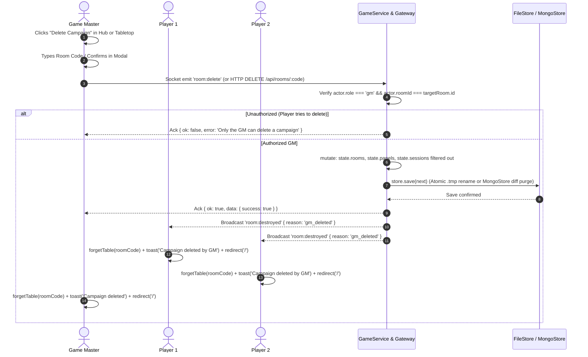

# Plan: Campaign Lifecycle Management — GM Deletion & Player Removal

This plan defines the architecture, security policies, storage operations, Socket.io teardown protocols, and UI flows for managing saved campaigns in Tavern. It establishes an authoritative distinction between a Game Master (GM) permanently deleting a campaign from the server and local storage, and a Player removing/leaving a campaign from their personal browser session.

Status: Planned (Phase 11).

---

## 1. Overview & Objectives

### 1.1 The Lifecycle Problem in Tavern

Currently, Tavern persists campaign credentials in browser `localStorage['tavern:tables:v1']` (retaining up to 20 recent tables) and on the server in `store.json` (FileStore) or MongoDB (MongoStore).
However, the application currently lacks explicit lifecycle cleanup actions:

1. **Server Accumulation & Orphaned Rooms**: There is no mechanism for a GM to dismantle an abandoned or completed campaign. Rooms, scenes, sessions, and roll histories persist indefinitely on the server.
2. **Hub Clutter for Players**: When a player joins a one-shot or test room, that table card remains pinned in their "Your Tables" (`#your-tables`) grid in `hub.tsx` with no option to dismiss or remove it.
3. **Ghost Tokens on Inactive Tables**: When players close their browser tabs without leaving, their tokens remain occupying grid tiles permanently, potentially blocking paths or spawn points.

### 1.2 Core Role Differentiation

To protect user data and ensure table integrity, campaign management implements strict asymmetric permissions based on authenticated roles:

- **Game Master (GM) — Permanently Delete Campaign (`Excluir Campanha`)**:
  - The GM owns the campaign.
  - Deletion is a destructive server-side operation that permanently purges the `Room`, all its `Panel` scenes, all `Session` records, character data, and roll histories from server storage (`GameStore`).
  - Active sockets in the room are notified via a `room:destroyed` event, their local credentials for that table are cleared, and they are redirected to the Hub with an informative toast.
  - The campaign card is permanently removed from the GM's local storage.
- **Player — Leave / Remove Campaign (`Sair / Remover Campanha`)**:
  - A player does not own the room and cannot delete shared world data.
  - Removing a campaign detaches the player's personal seat: it clears the saved credential from `localStorage['tavern:tables:v1']`.
  - If performed from inside the active tabletop, it notifies the server (`member:leave`), frees the player's occupied grid tile, disconnects the socket, and returns the player to the Hub.
  - The room remains active and untouched on the server for the GM and other party members.

---

## 2. Workspace & Codebase Audit

### 2.1 Affected Files & Modules

- `src/lib/sessions.ts`:
  - Add `forgetTable(roomCode: string): void`: Removes a room code from `localStorage['tavern:tables:v1']`.
  - Add `hasSavedSession(roomCode: string): boolean`.
- `src/components/hub.tsx`:
  - Enhance `.recent-table` cards in `#your-tables` with an accessible action menu (ellipsis or direct action icons: trash icon for GM, log-out/leave icon for player).
  - Mount `ConfirmDeleteModal` and `ConfirmLeaveModal` with keyboard focus containment, backdrop dismissal, and explicit confirmation guards.
- `src/components/tabletop.tsx`:
  - Add campaign management actions inside the tabletop top navigation / room settings dropdown:
    - GM view: "Excluir Campanha / Delete Campaign" (destructive red styling).
    - Player view: "Sair da Mesa / Leave Table".
- `src/types/game.ts`:
  - Add `RoomDestroyedEvent: { roomCode: string; reason: 'gm_deleted' | 'expired'; message: string }`.
  - Add `LeaveRoomRequest: { roomCode: string; memberId: string }`.
  - Extend `ClientEvents` with `'room:delete': (ack: Ack<{ success: boolean }>) => void`.
  - Extend `ServerEvents` with `'room:destroyed': (event: RoomDestroyedEvent) => void`.
- `src/lib/sessions.ts`:
  - Add `forgetTable(roomCode: string): void`: Removes a room code from `localStorage['tavern:tables:v1']`.
  - Add `hasSavedSession(roomCode: string): boolean`.
- `src/components/hub.tsx`:
  - Enhance `.recent-table` cards in `#your-tables` with an accessible action menu (ellipsis or direct action icons: trash icon for GM, log-out/leave icon for player).
  - Mount `ConfirmDeleteModal` and `ConfirmLeaveModal` with keyboard focus containment, backdrop dismissal, and explicit confirmation guards.
- `src/components/tabletop.tsx`:
  - Add campaign management actions inside the tabletop top navigation / room settings dropdown:
    - GM view: "Excluir Campanha / Delete Campaign" (destructive red styling).
    - Player view: "Sair da Mesa / Leave Table".
- `src/types/game.ts`:
  - Add `RoomDestroyedEvent: { roomCode: string; reason: 'gm_deleted' | 'expired'; message: string }`.
  - Add `LeaveRoomRequest: { roomCode: string; memberId: string }`.
  - Extend `ClientEvents` with `'room:delete': (ack: Ack<{ success: boolean }>) => void` and `'room:leave': (ack: Ack<{ success: boolean }>) => void`.
  - Extend `ServerEvents` with `'room:destroyed': (event: RoomDestroyedEvent) => void`.
- `src/server/game.ts`:
  - Implement `GameService.deleteRoom(actor: Session, roomCode: string): Promise<boolean>`:
    - Verify that `actor.role === 'gm'` and `actor.roomId === room.id`.
    - Purge room, panels, and sessions natively inside `this.mutate((state) => { ... })`.
    - Guarantees seamless compatibility with both `FileStore` and `MongoStore` without requiring replica-set transactions or desynchronizing `MongoStore.previous`.
  - Implement `GameService.leaveRoom(actor: Session): Promise<boolean>`:
    - Clear player's active token (`delete session.token`) from `state.sessions`, freeing that coordinate for other players' movement.
- `src/server/gateway.ts`:
  - Socket handler for `'room:delete'`: Invokes `game.deleteRoom()`, broadcasts `'room:destroyed'` to the room channel, and disconnects all joined sockets.
  - Socket handler for `'room:leave'`: Vacates player token and broadcasts updated presence/snapshot to remaining members.
- `server.ts`:
  - Add HTTP endpoint `DELETE /api/rooms/:code` with authentication headers for headless API usage.
- `messages/{en,es,pt-BR}.json`:
  - Localized strings for deletion confirmation, leave confirmation, warning dialogs, and toast notifications.

---

## 3. Detailed Architecture & Technical Contracts

### 3.1 GM Campaign Deletion Protocol



#### High-Stakes Confirmation Guardrail

Deleting a campaign is catastrophic if done accidentally. The GM confirmation modal (`ConfirmDeleteModal`) requires:

1. Prominent warning text explaining that all scenes, player characters, notes, and dice rolls will be wiped permanently.
2. An input verification field where the GM must type either the **exact Room Code** (e.g., `TVRN-W7K9P2`) or the localized keyword **`EXCLUIR`** before the destructive action button enables.
3. Destructive styling: Red button with trash icon and loading spinner while awaiting server acknowledgement.

### 3.2 Player Campaign Removal Protocol

When a player decides to leave or remove a campaign:

1. **From the Hub (`hub.tsx`)**:
   - The player hovers or focuses on the table card and clicks the "Remove / Forget" icon button (`<X size={16} />` or `<LogOut size={16} />`).
   - A dialog opens: _"Remover da lista? Você deixará esta mesa e ela não aparecerá mais no seu navegador. Para retornar, precisará de um novo convite do Mestre."_
   - Clicking "Remover" calls `forgetTable(table.roomCode)`.
   - The Hub updates its local state (`setRecent(savedTables())`), instantly removing the card with a smooth exit animation.
2. **From Inside the Tabletop (`tabletop.tsx`)**:
   - The player selects "Sair da Campanha" in the navigation dropdown.
   - The client emits `room:leave` to the gateway.
   - The server clears the player's active token (`delete session.token`), immediately freeing the grid tile for collision calculations across other players.
   - The client clears the local credential via `forgetTable(roomCode)` and calls `router.push('/')`.

---

## 4. Storage & Persistence Contracts

### 4.1 Native Store-Agnostic Mutation Pattern

Tavern's storage architecture relies on `GameService.mutate<T>(operation: (state: StoredGame) => T)`. Inside `mutate`, the state is modified in memory, and `this.store.save(next)` is invoked.

In `src/server/game.ts`:

```typescript
async deleteRoom(member: Session, roomCode: string): Promise<boolean> {
  return this.mutate((state) => {
    const actor = this.session(state, member);
    const room = this.roomFor(state, actor);
    if (actor.role !== 'gm' || room.gmId !== actor.id) {
      throw new Error('Only the game master can delete this campaign.');
    }
    if (room.code !== roomCode.trim().toUpperCase()) {
      throw new Error('Room code confirmation mismatch.');
    }

    const roomId = room.id;
    state.rooms = state.rooms.filter((r) => r.id !== roomId);
    state.panels = state.panels.filter((p) => p.roomId !== roomId);
    state.sessions = state.sessions.filter((s) => s.roomId !== roomId);

    return true;
  });
}
```

### 4.2 Why This Protects Store Integrity

1. **Zero Changes Needed in `GameStore` Interface**: By reusing `this.store.save(next)`, we preserve the existing, proven storage abstraction without creating redundant store-specific deletion methods.
2. **`FileStore` Compatibility**: Writes the filtered state to a temporary file (`.tmp`) and atomically renames it over the primary data file, guaranteeing zero corrupt state on disk.
3. **`MongoStore` Compatibility**:
   - `MongoStore.save(data)` already detects documents that exist in `this.previous` but are missing in `data`:
     ```typescript
     const retained = new Set(data[collection].map((item) => item.id));
     const removed = this.previous[collection]
       .filter((item) => !retained.has(item.id))
       .map((item) => item.id);
     if (removed.length) await db.collection(collection).deleteMany({ id: { $in: removed } });
     ```
   - Automatically and safely issues `deleteMany` across `rooms`, `panels`, and `sessions`.
   - Avoids calling `session.withTransaction()`, which fails catastrophically on standard standalone MongoDB instances.
   - Preserves `MongoStore.previous` cache integrity without any risk of desynchronization.

---

## 5. Security & Edge Cases

### 5.1 Authorization & Cryptographic Checks

- **Role Verification**: The gateway checks the caller's persisted `Session.tokenHash` against `Room.gmId`. Client-supplied claims are ignored.
- **Cross-Room Protection**: A GM from room A cannot pass credentials to delete room B. Target room code must match the actor's authenticated room.
- **Anti-Brute Force**: Deletion requests are rate-limited under the same strict HTTP rate-limiting rules (max 10 requests per minute).

### 5.2 Edge Cases Handled

1. **Player Offline During Deletion**: If a player is offline when the GM deletes the room, the next time they open the Hub, the room still exists in their `localStorage`. However, if they click it, the join request receives `404 Room Not Found`. The client gracefully detects this response, calls `forgetTable(roomCode)`, and notifies the user: _"Esta campanha não existe mais e foi removida das suas mesas salvas."_
2. **Concurrent Deletion & Painting**: If another user attempts to paint or roll dice at the exact moment the room is deleted, `GameService.mutate` processes the deletion first; subsequent operations fail cleanly with `ROOM_NOT_FOUND`.
3. **Token Vacuum / Collision Cleanup**: When a player uses "Sair da Mesa", their token (`session.token`) is immediately removed from `state.sessions`, vacating their coordinate so it is instantly walkable again for remaining players.

---

## 6. Implementation Phases & Steps

### Phase 11.1: Local Storage Helper & Hub UI

- [ ] Add `forgetTable` in `src/lib/sessions.ts`.
- [ ] Update `hub.tsx` to render action buttons on `.recent-table` cards:
  - GM cards: Red trash button (`Excluir`).
  - Player cards: Dismiss/leave button (`Remover`).
- [ ] Create `ConfirmDeleteDialog` and `ConfirmLeaveDialog` components with full accessibility (ARIA, focus trap, Escape key).

### Phase 11.2: Server Store & GameService Logic

- [ ] Implement `GameService.deleteRoom` inside `this.mutate`, cascade-clearing rooms, panels, and sessions without altering `GameStore` interface.
- [ ] Implement `GameService.leaveRoom` to safely clear player `session.token` and vacate collision.

### Phase 11.3: Gateway & Socket.io Handlers

- [ ] Add `room:delete` socket handler with acknowledgement.
- [ ] Broadcast `room:destroyed` to the room channel.
- [ ] Client-side listener for `room:destroyed` in `use-room.ts` that triggers `forgetTable`, shows toast, and navigates home.

### Phase 11.4: Tabletop Room Settings Integration

- [ ] Add room actions dropdown in `src/components/tabletop.tsx` topbar.
- [ ] Provide "Sair da Mesa" for players and "Excluir Campanha" for GM.

### Phase 11.5: Automated Verification & Regressions

- [ ] Unit tests for `GameService.deleteRoom` ensuring atomic cascade delete across rooms, panels, and sessions with zero orphans.
- [ ] Security tests ensuring non-GM sessions cannot invoke deletion.
- [ ] Playwright E2E tests:
  - GM deletes room -> player browser immediately receives broadcast, leaves room, and table disappears from both Hubs.
  - Player removes room from Hub -> only player's Hub is updated; GM and other players remain unaffected.

---

## 7. Verification Gates

1. **Unit & Integration Suite**: `npm test` passes with all new store and authorization specs.
2. **Type Checking**: `npm run typecheck` zero errors.
3. **Linter**: `npm run lint` clean.
4. **Browser E2E Suite**: `npx playwright test tests/e2e/campaign-lifecycle.spec.ts` passes.
5. **Production Build**: `npm run build` succeeds.
