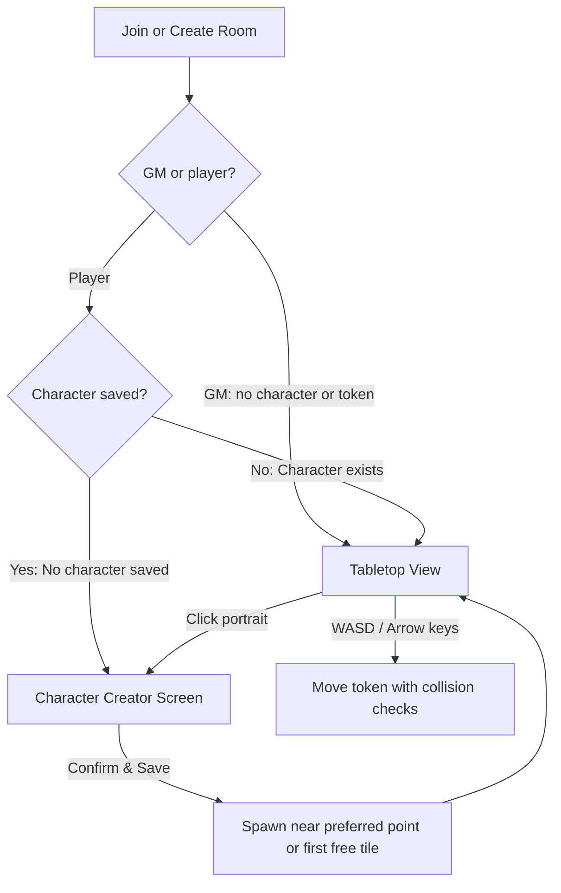

# Characters & tokens

Tavern provides a per-room character creation and token system inspired by the modular pixel-art aesthetic of _Stardew Valley_. Players customize their own adventurer when joining a table, receive a server-assigned position, and navigate the scene using directional keys or pointer controls. The validated implementation decisions are recorded in [the phase 4 plan](character_system_plan.md).



---

## 1. Principles & room scoping

1. **Per-room scoping**: Characters belong to the individual table session. A player can have a distinct character in each room they join. The character configuration is persisted with the member session in storage (`.tavern/store.json` and MongoDB).
2. **First-visit creation gate**: A player joining a room without a saved character sees the creator before the map. The GM coordinates the table without a character or token and opens the tabletop directly. Confirming saves the character and unlocks the tabletop, even if an empty/full scene has no free spawn tile yet.
3. **Always editable**: Players can reopen the creator modal from their portrait in the navigation, party list, or map HUD. Updating appearance preserves a valid position.
4. **Deterministic spawn**: Newly created player characters spawn on the free walkable tile nearest the scene's **preferred spawn point**. The GM marks it with the flag tool and can clear it. Without a preference, use the first free tile in row-major order.
5. **Direct keyboard & pointer movement**: Characters navigate the map using **WASD** or **Arrow keys**, respecting tile collisions (`blocked: true`), fog, scene boundaries, and the GM's room-wide movement permission (enabled by default). The GM can move any player to a valid free tile regardless of adjacency, fog or this permission.

---

## 2. Customization model (Stardew Valley inspired)

Customization uses original layered 16×16 pixel art scaled to 32×32 on the map and 160×160 in the creator preview. No external sprites or generation service is required.

| Element           | Parameter                    | Options                        | Description                                                                           |
| ----------------- | ---------------------------- | ------------------------------ | ------------------------------------------------------------------------------------- |
| **Skin / Body**   | `skinColor`                  | 8 palette tones                | Base tone for face, hands, and body silhouette.                                       |
| **Top / Hair**    | `hairStyle`<br>`hairColor`   | 10 styles<br>16 palette colors | Hair cut (short, parted, messy, ponytail, braids, mohawk, bald, etc.) and color tint. |
| **Shirt / Torso** | `shirtStyle`<br>`shirtColor` | 8 styles<br>16 palette colors  | Adventurer tunic, crewneck, vest, suspenders, robes, striped shirt, etc.              |
| **Pants / Legs**  | `pantsColor`                 | 12 palette colors              | Trousers, skirts, or shorts matching classic RPG palettes.                            |

### Color palettes

All colors follow Tavern's muted, retro fantasy overworld palette (matching the existing terrain colors):

- **Skin tones**: `#fcd0a1`, `#f5bc8c`, `#e8a773`, `#c78351`, `#9b5a32`, `#69381e`, `#dfc9b8`, `#8a998c` (orc/elf undertone).
- **Hair & clothing**: Vibrant yet earthy dyes (warm reds, forest greens, royal navy, mustard gold, leather brown, charcoal, linen white).

---

## 3. Data structures

```typescript
export interface CharacterAppearance {
  skinColor: string;
  hairStyle: number;
  hairColor: string;
  shirtStyle: number;
  shirtColor: string;
  pantsColor: string;
}

export interface PlayerToken {
  x: number;
  y: number;
  panelId: string;
}

export interface Member {
  id: string;
  nickname: string;
  role: Role;
  character?: CharacterAppearance;
  token?: PlayerToken;
}

export interface Session {
  id: string;
  roomId: string;
  nickname: string;
  role: Role;
  tokenHash: string;
  character?: CharacterAppearance;
  token?: PlayerToken;
}
```

---

## 4. Preferred spawn and free-tile fallback

GameService alone resolves the spawn position. Clients never choose a spawn:

1. The GM optionally sets `Panel.spawnPoint` to an in-bounds coordinate with the flag tool (click or arrows + Enter). The coordinate can be marked before painting; empty or blocked terrain is never a valid spawn. Scan the active grid in row-major order.
2. Choose the valid free coordinate with the smallest Manhattan distance to the preferred point, with row-major ties; without a preference, choose the first valid free coordinate. A tile qualifies when:
   - `terrain !== 'empty'`
   - `tile.blocked !== true`
   - Skip coordinates reserved by any other saved room character, including offline sessions.
3. If no free tile exists, save the character without a token and display “Waiting for a free tile”. Painting passable terrain retries waiting spawns. There is no unsafe `(0, 0)` fallback.
4. Assign `token = { x, y, panelId: activePanelId }`, persist, and publish the confirmed position.

Activating a different scene respawns room characters in session creation order. Clicking the already active scene preserves positions. Painting over occupied terrain relocates any invalidated token and retries waiting characters. Changing or clearing the preferred point preserves valid existing positions and retries waiting players. Duplicating a scene copies its preference. Only players reserve coordinates; legacy GM characters/tokens are removed on load. Positions are scoped to the active scene; this version does not retain a separate position in each inactive scene.

---

## 5. Movement and collision rules

### Controls

| Action       | Controls                                                            |
| ------------ | ------------------------------------------------------------------- |
| Move Up      | `W` or `ArrowUp`                                                    |
| Move Down    | `S` or `ArrowDown`                                                  |
| Move Left    | `A` or `ArrowLeft`                                                  |
| Move Right   | `D` or `ArrowRight`                                                 |
| Click / Drag | Click an adjacent tile / Drop your own token one adjacent tile away |
| Touch        | Direction buttons in Move mode                                      |

Players start in Move mode. The GM starts in Paint mode; choose the footprints tool or press `M`, then select a player in the party or by clicking their token. Click a destination or drag that token to reposition it; arrows and touch buttons step the selected player. The lock button allows or pauses players' own movement. `B` selects Paint and its terrain palette; `H` selects Pan. Keyboard movement applies while the map has focus, so forms and dialogs retain their own controls.

### Collision verification

A move from `(x, y)` to `(nextX, nextY)` is valid if and only if:

1. `0 <= nextX < panel.grid.cols` and `0 <= nextY < panel.grid.rows`.
2. The destination tile is not blocked (`tile?.blocked !== true`).
3. Terrain is non-empty. `blocked` alone controls terrain collision: the GM can make water or walls passable.
4. For player requests, Manhattan distance is exactly one for every input method; no diagonals or teleporting. GM requests may reposition the selected player at any distance.
5. No other saved room token occupies the destination.
6. The token belongs to the authenticated player, or the authenticated GM targets a player in their own room. The destination scene must be active. Player movement must be allowed by `Room.playersCanMove` (missing means true).
7. When fog is enabled, a player can enter only revealed coordinates. The GM may reposition players on hidden terrain.

### Synchronization lifecycle

1. **Request**: Keyboard, pointer, and direction buttons emit `token:move` with `{ x: nextX, y: nextY, panelId }`. GM requests additionally supply `memberId`; the server rejects player attempts to target another member. The canvas permits one in-flight move at a time.
2. **Server verification**: GameService reads the current saved session and checks all rules above.
3. **Persistence**: The mutation queue writes the new position before confirming it. Failed writes leave published state unchanged.
4. **Personalized broadcast**: Each room socket receives `token:moved`; another token hidden by fog is sent with its position omitted. The client renders only confirmed state. Prediction and rollback are deferred. Ordinary blocked/empty/occupied/hidden/non-adjacent/paused movement refusals carry `MOVE_REJECTED` and do not display an alert; other failures remain visible.

---

## 6. Rendering pipeline

The token renderer in `src/components/canvas/character.ts` uses the same Canvas 2D procedural approach as the terrain renderer:

```typescript
export function drawCharacter(
  ctx: CanvasRenderingContext2D,
  appearance: CharacterAppearance,
  x: number,
  y: number,
  size: number,
  direction: 'down' | 'up' | 'left' | 'right' = 'down',
): void;
```

### Layer ordering

1. **Shadow**: Subtle pixel shadow under the token.
2. **Body & legs**: Base silhouette and pants colored by `pantsColor`.
3. **Shirt & arms**: Torso pattern based on `shirtStyle` and tinted with `shirtColor`.
4. **Head & face**: Head shape with `skinColor` and dark pixel eyes.
5. **Hair**: Modular hair shape based on `hairStyle` and tinted with `hairColor`.
6. **Token outline / Nickname label**: Gold outline for your own token or the GM's selected player, linen outline for other tokens, and a nickname above each token. Portraits use the same layers.

---

## 7. Socket.io contracts

| Client event       | Payload                                                        | Acknowledgement            | Broadcast                         |
| ------------------ | -------------------------------------------------------------- | -------------------------- | --------------------------------- |
| `character:update` | `CharacterAppearance`                                          | `Ack<CharacterAppearance>` | `room:presence` & `room:snapshot` |
| `token:move`       | `{ x: number, y: number, panelId: string, memberId?: string }` | `Ack<PlayerToken>`         | `token:moved`                     |

`room:movement` accepts `{ allowed: boolean }`; `panel:spawn` accepts `{ panelId, point: { x, y } | null }`. Both are GM-only, persist before acknowledgment and publish personalized snapshots. Appearance fields use the shadcn/Radix Select with labeled keyboard-accessible menus.

### Server events

- `token:moved`: `{ memberId: string, token?: PlayerToken }`; an omitted position removes a hidden token from that recipient's view.
- `room:presence`: updated member list including active tokens and character appearances.

Presence and snapshots re-read current sessions rather than reusing the socket's initial authentication object. Private bearer credentials and hashes never enter public members.

## 8. Fog and dice

Characters may select a class and optional subclass from their room's GM-managed catalog during onboarding or portrait editing. The creator shows the six effective modifiers (class plus subclass) and descriptive buffs/debuffs from both. The GM configures the default Guerreiro, Mago, Bárbaro, and Arqueiro catalog before creating a table or through the live Classes button. Removing definitions clears affected selections while preserving appearance and position.

Players with a selected class can make one-click attribute checks from the desktop dice sidebar or mobile drawer. The server derives the current modifier and test label from the saved character and room catalog, rolls one d20, and stores the applied bonus with the result. Class edits update future checks while history retains earlier bonuses. Traits are narrative descriptions; equipment and automated combat rules remain outside this phase. See the [attribute system plan](attribute_system_plan.md).

Fog is stored per scene as `{ enabled, revealed: string[] }`, with coordinate keys such as `"3,4"`. The GM toggles fog and uses Reveal/Hide tools with pointer strokes or keyboard painting. Strokes send at most 64 coordinates per request. Players receive only revealed terrain and sprites, and positions of other characters on revealed coordinates. Their own token remains available. Hidden tile edits send personalized snapshots rather than unfiltered tile broadcasts.

The dice log supports `XdY`/`dY` notation with signed modifiers and quick buttons for d4/d6/d8/d10/d12/d20, 1–20 dice, and modifiers from −1000 to 1000. It is docked on desktop and opens as a drawer below 980px. The server generates each face with `crypto.randomInt`, retains d100 request compatibility, persists the last 20 rolls per room with author roles, and broadcasts the result. Each live roll briefly animates before displaying its confirmed total and faces; reduced motion skips the animation. Reconnection restores history without replaying it. Dice do not automate RPG rules. See the [dice system plan](dice_system_plan.md).
