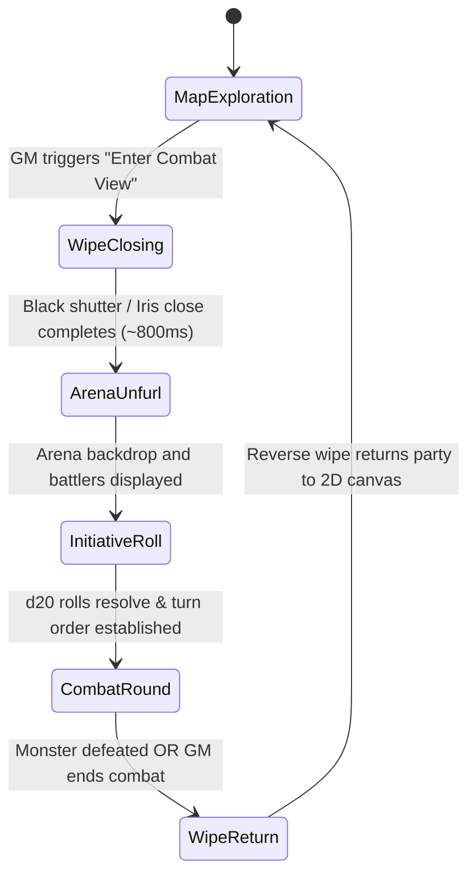

# Plan: Classic Turn-Based Combat View & Arena Scene Transition

This plan defines the architecture, animation pipeline, turn-based initiative engine, class attack catalogs, and Game Master (GM) targeting controls for Tavern's dedicated Combat View. Inspired by classic turn-based JRPGs (_Chrono Trigger_, _Final Fantasy_, _Dragon Quest_) and tabletop RPG combat encounters, this system allows the GM to transition the entire table from freeform exploration into a high-stakes tactical battle arena.

Status: Implemented and verified (Phase 13).

The reconciled scope and cross-plan decisions are recorded in [execution checklist](expansion_execution.md).

---

## 1. Overview & Design Philosophy

### 1.1 Freeform Exploration vs. Opt-In Tactical Combat

In tabletop RPGs, not every encounter requires rigid grid positioning and initiative tracking. Often, GMs prefer casual, theatre-of-the-mind exploration or fluid token movement on the canvas.
However, when an encounter reaches a climactic confrontation with a formidable foe, moving into a formal combat structure elevates drama, clarifies turn order, and ensures every player gets their moment to act.
Key design tenets:

1. **GM-Discretion Transition**: The GM decides when to engage Combat View. It is never forced automatically simply by stepping near a monster.
2. **Dramatic Retro Screen Transition ("The Battle Wipe")**: Entering combat triggers a synchronized screen-closing animation (iris/shutter/mosaic wipe) that transitions all players simultaneously from the 2D map into the battle arena.
3. **Classic Side-View Battle Layout**:
   - **Left**: Party members arranged vertically, facing right, displaying their custom pixel-art portraits, class badges, and active HP bars.
   - **Right**: The adversary / monster positioned prominently, facing left.
4. **d20 Initiative Round**: At the start of combat (and subsequent rounds), all participants roll a d20 (modified by Dexterity) to determine the action queue.
5. **Class-Specific Player Attacks & GM-Targeted 1d12 Monster Attacks**: Each hero class possesses an initial default thematic attack (fully editable by the GM). New custom monsters default to `1d12`; preset monsters retain their bestiary formulas (all customizable by the GM), and the GM explicitly chooses which adventurer the monster strikes.

---

## 2. The Battle Transition Animation Pipeline ("The Wipe")

To honor the retro JRPG inspiration (_Chrono Trigger_, _Final Fantasy IV/VI_), the transition must feel dramatic, impactful, and synchronized across all clients:



### 2.1 Visual Stages of the Transition

1. **Stage 1 — Battle Cue (0ms – 100ms)**:
   - A dramatic retro visual flash occurs on the canvas.
   - A short synthesized audio cue plays (subtle retro arpeggio / encounter chord).
2. **Stage 2 — Screen Wipe Closure (100ms – 800ms)**:
   - A full-screen overlay mounts with `z-index: 50`.
   - Dual shutter panels slide inward horizontally from left and right (or a radial diamond iris contracts toward the encounter focal point) until the map is completely masked in dark obsidian.
3. **Stage 3 — Arena Unfurl (800ms – 1200ms)**:
   - The shutters part smoothly to reveal the tactical Combat View arena.
   - The arena background dynamically matches the active scene's dominant terrain:
     - Forest/Grass: Sunlit woodland clearing with mossy boulders.
     - Dungeon/Stone: Dark cavern hall with torchlight and cracked flagstones.
     - Snow: Bleak glacial peak with swirling snowflakes.
     - Sand/Desert: Sun-baked desert canyon with ancient ruins.
4. **Stage 4 — Battler Entry**:
   - Player sprites slide in smoothly from the left.
   - The monster sprite emerges with an imposing scale animation from the right.

### 2.2 Accessibility & Performance

- Supports `prefers-reduced-motion`: When active, the dramatic shutter wipe and screen shake are replaced with a simple, calm 200ms opacity cross-fade.
- Built using high-performance CSS hardware-accelerated transforms (`transform: translate3d(...)`) and SVG clip-paths, avoiding CPU-bound canvas re-renders during the transition.

---

## 3. Combat View Spatial Layout & User Interface

The Combat View (`<CombatArena />`) occupies a full-bleed overlay above the canvas:

```
+-----------------------------------------------------------------------------------+
|  [Round 1]  TURN ORDER: [Guerreiro (18)] -> [Monstro (15)] -> [Mago (9)]   [Exit] |
+-----------------------------------------------------------------------------------+
|                                                                                   |
|  [PARTY (LEFT)]                                            [MONSTER (RIGHT)]      |
|                                                                                   |
|  [Token] Thorin (Guerreiro)                                   /\_/\               |
|          HP: [██████████] 24/24                             ( o.o ) [Giant Bat]   |
|          * ACTIVE TURN *                                     > ^ <  HP: [██████░] |
|                                                                                   |
|  [Token] Lyra (Maga)                                                              |
|          HP: [████████░░] 16/18                                                   |
|                                                                                   |
|  [Token] Kael (Arqueiro)                                                          |
|          HP: [██████████] 20/20                                                   |
|                                                                                   |
+-----------------------------------------------------------------------------------+
|  ACTION DOCK:                                                                     |
|  (Player Turn) [Golpe Poderoso (1d8+FOR)]  [Defender (+2 CA)]  [Rolar Dado Livre] |
|  (GM Turn)     Alvo: (•) Thorin  ( ) Lyra  ( ) Kael   [Rolar Ataque (1d12)]       |
+-----------------------------------------------------------------------------------+
```

### 3.1 Party Column (Left Side)

- Players are stacked vertically facing right.
- For each character:
  - Custom 16×16 modular pixel-art sprite with walking/idle animation frames.
  - Character name, Class badge, and Subclass tag.
  - Dynamic HP bar with numeric indicator (`current / max`).
  - Active turn halo (pulsing golden glow when it is this character's turn).
  - Incapacitated state: Fallen pose and `0 HP (KO)` badge if health drops to zero.

### 3.2 Monster Battler (Right Side)

- Monster sprite scaled prominently (e.g. 2× or 3× pixel zoom) facing left.
- Monster Name plate.
- Monster Health Bar:
  - Respects the GM's configured `HpVisibility`:
    - `gm_only`: Hidden from players; visible only to the GM.
    - `bar_only`: Visual colored bar visible to all; numeric HP visible only to GM.
    - `public`: Bar and numeric values visible to all.

### 3.3 Initiative Ribbon / Turn Order Tracker (Top Bar)

- Displays horizontal avatars of all combatants in descending order of their initiative score.
- Highlights the currently active combatant.
- Displays the current **Round Number** (`Rodada 1`, `Rodada 2`, etc.).

---

## 4. Initiative System (d20 Roll at Start of Every Round)

### 4.1 Authoritative Round-by-Round Initiative Engine

In classic tabletop and retro RPGs, turn order is dynamic and re-evaluated per round:

> _"onde no inicio da rodada todos rodam um d20 para saber a ordem de ataque."_

1. **Round Initialization (`round: 1, 2, ...`)**:
   - At the beginning of each round (upon entering combat and whenever `turnIndex >= turnQueue.length`):
   - The server automatically rolls an authoritative d20 for every conscious party member and the monster:
     - For Players: `1d20 + DES` (where `DES` is the character's Dexterity modifier derived from class and subclass).
     - For Monsters: `1d20 + Monster DES` (derived from `monster.attributes.destreza`).
   - If a player character is unformed (no class selected), the roll uses a neutral modifier (`+0`).
2. **Attribution & Shared Dice Log**:
   - Each initiative roll is published to the shared party dice log (`DiceRoll`) with `label: "Iniciativa (Rodada N)"` and trusted badges.
3. **Queue Sorting & Tie Breaking**:
   - The server sorts `turnQueue` in descending order of total initiative (`values[0] + modifier`).
   - Ties are broken by highest base Dexterity attribute; remaining ties are resolved deterministically by participant UUID.
4. **Turn Execution & Pointer**:
   - `turnIndex: 0` points to the fastest combatant.
   - When the active combatant takes an action (or passes), the server advances `turnIndex: turnIndex + 1`.
   - If the next participant is Incapacitated (0 HP), the turn is automatically skipped or marked as KO.
   - When `turnIndex` reaches `turnQueue.length`, the server automatically increments `round: round + 1`, generates a new batch of d20 rolls, and sorts the new round's queue!

---

## 5. Player Class Attacks (Default & GM Configurable)

### 5.1 Canonical 4 Class Default Attacks

In the initial scope, each default class in Tavern receives **one thematic default attack**, stored directly on `CharacterClass.defaultAttack`:

| Class                   | Default Attack Name              | Base Attribute       | Attack Roll (To-Hit) | Damage Formula | Damage Type & Description                                                  |
| :---------------------- | :------------------------------- | :------------------- | :------------------- | :------------- | :------------------------------------------------------------------------- |
| **Guerreiro (Warrior)** | _Golpe Poderoso_ (Heavy Strike)  | `forca` (STR)        | `1d20 + FOR`         | `1d8 + FOR`    | Físico Cortante: Um golpe contundente com espada longa de aço.             |
| **Mago (Mage)**         | _Dardo Místico_ (Arcane Dart)    | `inteligencia` (INT) | `1d20 + INT`         | `1d6 + INT`    | Energia Arcana: Um projétil de força mística pura que rasga o ar.          |
| **Bárbaro (Barbarian)** | _Fúria Brutal_ (Reckless Cleave) | `forca` (STR)        | `1d20 + FOR`         | `1d12 + FOR`   | Físico Contundente: Uma machadada esmagadora desferida com fúria selvagem. |
| **Arqueiro (Archer)**   | _Disparo Preciso_ (Aimed Shot)   | `destreza` (DEX)     | `1d20 + DES`         | `1d8 + DES`    | Físico Perfurante: Uma flecha emplumada disparada direto no ponto fraco.   |

- **Fallback Attack**: For custom GM-created classes where no attack was explicitly configured, Tavern provides a clean fallback: _"Ataque Básico"_ (`1d6 + FOR`).

### 5.2 GM Attack Customization in Class Manager

In `src/components/class-manager.tsx`:

- The GM can edit each class's attack:
  - Attack Name (e.g. rename _Golpe Poderoso_ to _Lâmina Sagrada_).
  - Governing Attribute (`forca`, `destreza`, `inteligencia`, `sabedoria`, `constituicao`, `carisma`).
  - Damage Dice Notation (validated numeric notation with `dice-notation.ts`, e.g. `1d8`, `2d6`, `1d10`; the governing attribute is added separately by the server).
  - Description.

### 5.3 Player Attack Execution Flow

1. When it is the player's turn:
2. The player's Action Dock lights up with their class attack button: `[Golpe Poderoso (1d8 + FOR)]`.
3. The player clicks the attack button (or GM can click it if the player is disconnected).
4. The server executes the authoritative roll:
   - Rolls damage and logs to the shared dice log with attribution: _"Thorin atacou o Esqueleto com Golpe Poderoso: 1d8+3 = 9 de dano!"_
5. The combat arena triggers a visual slash/spell animation over the monster sprite.
6. Damage is subtracted from the monster's `currentHp`. If reduced to 0, the monster is marked as defeated.
7. The server automatically advances `turnIndex` to the next combatant.

---

## 6. Monster Attacks (1d12 Default & GM Target Selection)

### 6.1 Attack Mechanics & Defaults

- **Default Dice Notation**: New custom monsters use **`1d12`**; existing bestiary presets preserve their thematic formulas. The GM can override either.
- **GM Customization**: The GM can override this formula per monster definition (e.g. `2d6`, `1d10+3`, `2d12`).
- **Target Selection**: The GM explicitly chooses which living adventurer the monster attacks.

### 6.2 GM Monster Turn Workflow

1. When the initiative queue lands on the Monster's turn:
2. The GM interface displays the **Monster Command Panel**:
   - Lists all conscious party members with radio selection chips:
     - `(•) Thorin (Guerreiro - 24/24 HP)`
     - `( ) Lyra (Maga - 16/18 HP)`
     - `( ) Kael (Arqueiro - 20/20 HP)`
   - The GM selects the intended target.
3. The GM clicks the primary action button: **"Executar Ataque do Monstro (1d12)"**:
   - The server rolls `1d12` (or configured notation).
   - The roll is broadcast to the party dice log: _"[GM] Esqueleto atacou Thorin com 1d12 = 8 de dano!"_
   - An impact shake animation triggers on Thorin's avatar on the left.
   - The server applies the damage to Thorin's `CharacterHealth.current` (clamped to 0).
4. The GM clicks "Avançar Turno" (or auto-advances after a 1.5s visual settle delay).

---

## 7. Combat Resolution & Return to Exploration

### 7.1 Victory Condition

- When the monster's HP reaches 0:
  - Victory banner unfurls: _"Vitória da Party!"_.
  - Monster sprite plays a defeat fade-out effect.
  - Action dock presents the GM with: **"Encerrar Combate & Retornar ao Mapa"**.

### 7.2 Tactical Retreat / GM Discretion

- At any point during combat, the GM can click the **"Encerrar Visão de Luta"** button in the top bar.
- Reverse wipe animation executes:
  - The arena closes smoothly.
  - The camera returns to the 2D Canvas scene.
  - All character and monster HP adjustments incurred during the battle are seamlessly preserved.

---

## 8. Data Models & Networking Contracts

### 8.1 Data Types (`src/types/game.ts`)

```typescript
export interface ClassAttack {
  id: string;
  name: string;
  description: string;
  attributeId: AttributeId; // 'forca' | 'destreza' | 'inteligencia' | 'sabedoria' | 'constituicao' | 'carisma'
  damageNotation: string; // e.g. "1d8", "1d6", "1d12"
}

// CharacterClass extension
export interface CharacterClass extends CharacterSubclass {
  subclasses: CharacterSubclass[];
  defaultAttack?: ClassAttack; // Default class attack for Combat View
}

export interface CombatParticipant {
  id: string; // Member ID or Monster Instance ID
  type: 'player' | 'monster';
  name: string;
  initiative: number;
  dexterityModifier: number;
  // HP/appearance are read from canonical sessions and redacted monster snapshots.
}

export interface ActiveCombatState {
  id: string; // UUID of active encounter
  panelId: string; // Scene where combat occurs
  monsterId: string; // Target monster instance ID
  round: number; // Current round (1, 2, ...)
  turnIndex: number; // Index in turnQueue
  turnQueue: CombatParticipant[];
  partyIds: string[];
  status: 'active' | 'resolved';
  lastAction?: CombatEffect;
}

// Extension to Room
export interface Room {
  // ... existing fields
  activeCombat?: ActiveCombatState | null;
}
```

### 8.2 Socket Events (`src/server/gateway.ts`)

- `combat:start`: `{ panelId: string; monsterId: string }` (GM only).
- `combat:started`: `{ combat: ActiveCombatState }` (Broadcast to room).
- `combat:attack_player`: `{ targetMonsterId: string; attackId: string }` (Player or GM).
- `combat:attack_monster`: `{ targetMemberId: string; damageNotation?: string }` (GM only).
- `combat:next_turn`: `{}` (GM or current player).
- `combat:end`: `{}` (GM only).
- `combat:ended`: `{ reason: 'victory' | 'fled' | 'gm_dismissed' }` (Broadcast to room).

---

## 9. Implementation Phases & Steps

### Phase 13.1: Attack Catalog & Domain Types

- [x] Define `ClassAttack`, `CombatParticipant`, and `ActiveCombatState` in `src/types/game.ts`.
- [x] Add default attacks to `defaultClasses` in `src/lib/classes.ts`.
- [x] Add Zod schemas in `src/lib/validation.ts` for attack definitions and combat actions.
- [x] Expose attack customization fields inside `class-manager.tsx`.

### Phase 13.2: Authoritative Server Combat Engine

- [x] Implement `startCombat`, `rollInitiative`, `executePlayerAttack`, `executeMonsterAttack`, and `endCombat` in `GameService`.
- [x] Integrate dice rolls with existing authoritative `rollDice` engine so combat attacks appear in shared history.
- [x] Authoritatively synchronize health updates across `session.health` and `monster.currentHp`.

### Phase 13.3: Socket Gateway & Client State Hook

- [x] Add gateway event handlers in `src/server/gateway.ts`.
- [x] Extend `use-room.ts` with combat actions and re-synchronization on reconnect.

### Phase 13.4: Transition Wipe Animation & Arena Layout

- [x] Create `CombatTransitionWipe` component with shutter/iris CSS animation and reduced-motion fallbacks.
- [x] Create `CombatArena` component with party column (left), monster column (right), and initiative tracker (top).
- [x] Connect dynamic terrain backdrops based on current scene terrain.

### Phase 13.5: Action Docks & GM Targeting Interface

- [x] Build player Action Dock with class attack trigger and visual attack animations.
- [x] Build GM Monster Action Dock with player target picker and configured damage notation (`1d12` for new custom monsters).
- [x] Implement victory screen and return-to-map transition.

### Phase 13.6: Automated Verification & Regressions

- [x] Unit tests for initiative sorting, tie-breaking, and turn advancing.
- [x] Tests verifying players cannot trigger monster attacks or forge attacks out of turn.
- [x] Playwright E2E tests:
  - GM summons monster and triggers Combat View.
  - Battle wipe animation plays, arena displays party on left and monster on right.
  - Initiative rolls resolve; player attacks monster, GM selects player target and rolls monster 1d12.
  - Combat ends and returns smoothly to map canvas.

---

## 10. Verification Gates

1. **Unit & Domain Tests**: `npm test` passes with all initiative, attack, and authorization checks.
2. **Type Checking**: `npm run typecheck` zero errors.
3. **Linter**: `npm run lint` passes without warnings.
4. **Browser E2E Suite**: `npx playwright test tests/e2e/combat-view.spec.ts` passes.
5. **Production Build**: `npm run build` succeeds cleanly.

Verified on 2026-10-04: all 86 unit/domain/integration tests and 36 browser tests pass, together with TypeScript, ESLint, formatting and the production build. See the [execution evidence](expansion_execution.md). Live MongoDB integration was not run because `MONGODB_TEST_URI` is not configured.
