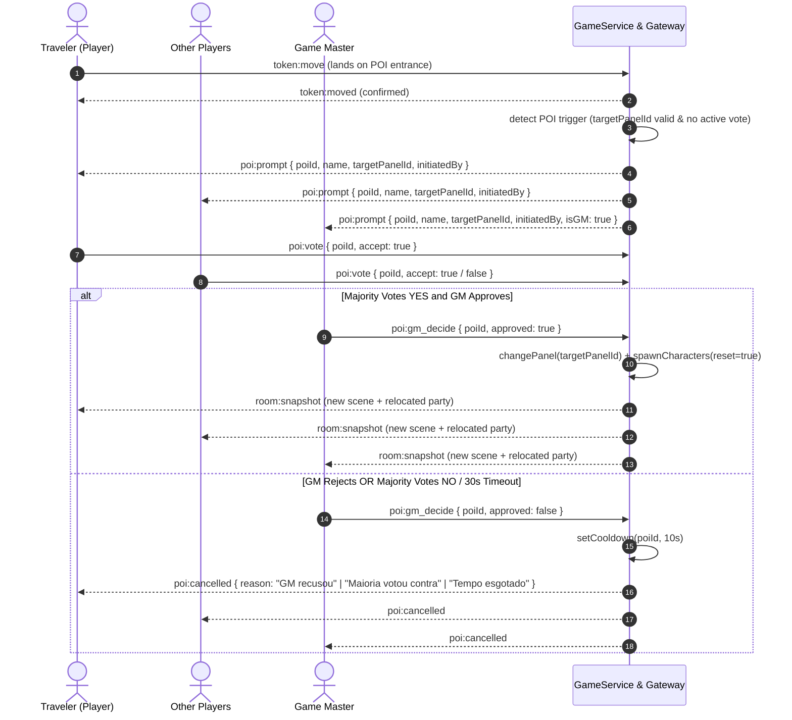

# Plan: World Sprites, Categorized Tabs & Multi-Tile POI Scene Transitions

This plan defines the architecture, data models, canvas rendering, UI components, and networking protocols for expanding world customization with categorized sprite tabs (using shadcn/ui Tabs), adding snow/sand mountains, multi-tile (3×3 and 2×2) Points of Interest (POIs) inspired by classic RPG overworlds (_Chrono Trigger_), and an authoritative group scene-transition voting system.

Status: Planned (Phase 10).

---

## 1. Overview & Design Philosophy

### 1.1 Overworld Exploration in the Spirit of _Chrono Trigger_

In classic 16-bit RPGs such as _Chrono Trigger_ and _Final Fantasy VI_, the overworld map connects vast regions through recognizable multi-tile landmark structures:

- Walled settlements, castles, and coastal towns visible from the world map.
- Dark gaping cave entrances and ancient dungeon ruins inviting exploration.
- Stepping onto these landmarks triggers a seamless transition into a dedicated local environment.

In virtual tabletops (VTTs), maintaining party cohesion and player agency is paramount. Moving a player token into a Point of Interest (POI) shouldn't jarringly tear one player away or hijack the entire group without consent. Instead, Tavern implements a **Group Travel Prompt**:

1. When any adventurer steps onto a landmark entrance tile, a non-intrusive transition prompt appears for all active party members and the Game Master (GM).
2. The group votes ("Enter" or "Stay").
3. If the majority votes to enter and the GM approves (or if the GM unilaterally decides to advance), the server atomically switches the active scene (`Panel`) and places all party members at the destination scene's designated spawn point.

### 1.2 Categorized Terrain Palette with shadcn/ui Tabs

Tavern's current terrain dock (`.brush-dock`) displays a flat list of 10 terrain buttons. As the catalog expands with urban tiles, dungeon flagstones, props, and multi-tile structures, a flat toolbar becomes unwieldy.
We introduce categorized tabs using `@radix-ui/react-tabs` (the foundation of shadcn/ui Tabs), styled to match Tavern's warm fantasy dark-slate aesthetic:

1. **World (Mundo)**: Procedural natural terrains, mountains (rocky, snow, sand dunes), and 3×3 overworld POIs (town, dungeon, castle, shrine).
2. **Cities (Cidades)**: Urban cobblestone, brick sidewalks, 2×2 houses, street lamps, barrels, crates, and fountains.
3. **Dungeons (Dungeões)**: Dark flagstones, cracked tiles, mossy stone walls, prison iron bars, skeleton remains, torches, and treasure chests.
4. **Interiors & Tavern (Interiores & Taverna)**: Wood plank floors, timber walls, 2×2 tavern bars, long banquet tables with tankards, fireplaces, and inn beds.

---

## 2. Workspace & Codebase Audit

### 2.1 Affected Files & Modules

- `src/components/ui/tabs.tsx`: New accessible component built on `@radix-ui/react-tabs` conforming to Tavern styling and keyboard arrow navigation.
- `src/types/game.ts`:
  - Extend `Terrain` with `'sand_mountain' | 'snow_mountain' | 'dungeon_floor' | 'dungeon_wall' | 'cobblestone' | 'wood_floor' | 'wood_wall'`.
  - Add `MultiTileDimension: { cols: number; rows: number }`.
  - Add `PoiType: 'town' | 'dungeon' | 'castle' | 'shrine' | 'custom'`.
  - Add `PoiMetadata` and `MultiTileStructure` interfaces.
  - Extend `Tile` with optional `structureId?: string; structureRoot?: boolean`.
  - Extend `ClientEvents` and `ServerEvents` with POI voting and transition events.
- `src/lib/terrain.ts`:
  - Group terrain definitions into tabs (`world`, `city`, `dungeon`, `interior`).
  - Add metadata for multi-tile brush templates (2×2 and 3×3 footprints).
- `src/lib/validation.ts`:
  - Zod schemas for POI placement, POI configuration, voting payload, and GM decision.
- `src/components/canvas/render.ts`:
  - Canvas 2D procedural pixel-art routines for snow mountains, sand mountain dunes, cobblestone, dungeon flagstones, wood planks, and skeleton remains.
  - Multi-tile composite sprite rendering engine supporting 64×64 (2×2) and 96×96 (3×3) assets.
- `src/components/canvas/map-canvas.tsx`:
  - Multi-tile brush hover preview: Draws a 2×2 or 3×3 bounding box with placement validity indicator (green = valid, red = out of bounds).
  - POI trigger collision detection: Detects when a moving player token lands on a POI entrance coordinate.
- `src/components/tabletop.tsx`:
  - Refactor `.brush-dock` into categorized shadcn/ui Tabs.
  - Mount the `PoiTransitionModal` overlay for active votes.
- `src/components/poi-transition-modal.tsx`:
  - Accessible modal dialog for party voting with countdown timer, member status chips, and GM override controls.
- `src/server/game.ts`:
  - Authoritative multi-tile placement and removal validation (atomic footprint verification).
  - POI entry trigger processing and voting state management.
  - Authoritative scene transition on vote resolution.
- `src/server/gateway.ts`:
  - Socket handlers for `poi:prompt`, `poi:vote`, `poi:gm_decide`, and `poi:transition`.
- `messages/{en,es,pt-BR}.json`:
  - Localized strings for tabs, tooltips, POI names, and voting dialogs.

---

## 3. Categorized Palette Specification (shadcn/ui Tabs)

### 3.1 Tab 1: World / Overworld (Mundo)

Designed for macroscopic adventure maps and continental travel:

- **Base 1×1 Terrains**:
  - `grass`: Verdant green wild grass.
  - `forest`: Dense pine/oak canopy.
  - `water`: Animated river/ocean water.
  - `mountain`: Rocky gray stone peak.
  - `sand`: Golden desert sand.
  - `snow`: White frost and packed snow.
  - `flowers`: Flowering meadow.
  - **NEW** `snow_mountain`: Glacial snow-capped mountain peak with icy blue shadows.
  - **NEW** `sand_mountain`: Wind-swept desert dune peak with warm terracotta ridges.
- **3×3 Overworld Landmark Structures (Chrono Trigger Style, 96×96 px footprint)**:
  - `poi_town`: Medieval fortified town with thatched roofs, wooden watchtower, stone perimeter wall, and a south-facing wooden archway gate.
  - `poi_dungeon`: Ominous craggy rock formation with a dark gaping cave entrance and eerie greenish mist.
  - `poi_castle`: Royal fortress with stone battlements, twin turrets, crimson pennant flags, and an iron portcullis.
  - `poi_shrine`: Mystical ancient stone henge circle with glowing runic obelisk in the center.

### 3.2 Tab 2: Cities & Settlements (Cidades)

Designed for urban encounters, market squares, and village streets:

- **Base 1×1 Terrains**:
  - `cobblestone`: Irregular gray cobblestone street with mortar lines.
  - `stone_pavement`: Smooth dressed stone pavers for sidewalks and plazas.
  - `water_canal`: Stone-lined urban drainage or scenic canal.
- **2×2 Buildings & Shops (64×64 px footprint)**:
  - `house_timber`: Two-story half-timbered merchant house with clay-tiled roof and glass window panes.
  - `tavern_exterior`: Boisterous inn with hanging wooden mug sign and smoking stone chimney.
  - `blacksmith_shop`: Open-front forge with stone chimney, anvil, and weapon rack.
- **1×1 Urban Props**:
  - `lamppost`: Wrought-iron gas street lamp with subtle warm lighting halo.
  - `crates_barrels`: Stack of wooden storage crates and iron-banded casks.
  - `fountain`: Carved stone water fountain with tiered basins.
  - `water_well`: Village stone well with wooden bucket and crank.

### 3.3 Tab 3: Dungeons & Catacombs (Dungeões)

Designed for subterranean labyrinths, crypts, and dangerous ruins:

- **Base 1×1 Terrains**:
  - `dungeon_floor`: Dark charcoal flagstones with cracks and mossy crevices.
  - `dungeon_dirt`: Damp subterranean packed dirt with scattered pebbles.
  - `lava_pool`: Glowing molten magma bubbling between cracked stone.
  - `acid_pool`: Toxic luminous green bubbling puddle.
- **1×1 Walls & Barriers**:
  - `dungeon_wall`: Chiseled dark granite block wall with masonry shadows.
  - `iron_bars`: Heavy iron prison portcullis / cage bars (blocked, translucent).
  - `wooden_door_closed` / `wooden_door_open`: Reinforced iron-studded dungeon door.
- **1×1 Subterranean Props**:
  - `skeleton_remains`: Scattered human and beast skeletal remains on stone.
  - `wall_torch`: Burning wall bracket torch with flickering flame.
  - `treasure_chest`: Iron-banded wooden chest (toggleable closed/open).
  - `sacrificial_altar`: Weathered bloodstone altar carved with ancient glyphs.

### 3.4 Tab 4: Interiors & Tavern (Interiores & Taverna)

Identified as the ideal 4th tab, matching the core identity of the platform:

- **Base 1×1 Terrains**:
  - `wood_floor`: Warm polished oak floorboards with wood-grain knots.
  - `wood_wall`: Sturdy cedar log or vertical plank wall.
  - `ornate_rug`: Decorative woven crimson and gold carpet.
- **2×2 Interior Centers (64×64 px footprint)**:
  - `tavern_counter`: Polished mahogany tavern bar counter with beer taps and back-shelf bottles.
  - `banquet_table`: Long rustic feast table set with wooden plates, tankards, and roasted fowl.
- **1×1 Furniture & Comforts**:
  - `stone_fireplace`: Hearth with glowing wood fire and mantlepiece.
  - `inn_bed`: Cozy wooden bed with straw mattress and patchwork quilt.
  - `bookshelf`: Towering wooden shelving filled with leather-bound tomes and scrolls.
  - `wood_chair`: Wooden tavern chair facing the table.

---

## 4. Multi-Tile (2×2 and 3×3) Technical Architecture

### 4.1 Data Model: Anchor Tile & Footprint System

To preserve Tavern's high-performance sparse tile storage (`Tile[]`) without requiring breaking schema overhauls:

1. **Structure Metadata Storage on `Panel`**:
   - Each `Panel` persists an array of placed structures:
     ```typescript
     export interface StructureAnchor {
       id: string; // Unique UUID for this placed structure
       templateKey: string; // e.g., 'poi_town', 'house_timber'
       category: 'world' | 'city' | 'dungeon' | 'interior';
       x: number; // Top-left anchor coordinate
       y: number; // Top-left anchor coordinate
       cols: number; // 2 or 3
       rows: number; // 2 or 3
       targetPanelId?: string; // Configured destination scene for POIs
       entranceOffset: { dx: number; dy: number }; // Entrance coordinate (e.g. { dx: 1, dy: 2 } for 3x3)
     }
     ```
   - `Panel` type extension in `src/types/game.ts`: `structures?: StructureAnchor[]`.
2. **Anchor Tile & Footprint Tiles**:
   - When a GM paints a 3×3 or 2×2 structure, the server registers the `StructureAnchor` on `panel.structures`, creates the anchor tile at `(x, y)` with `structureId: anchor.id; structureRoot: true`, and automatically writes all covering child tiles `(x + dx, y + dy)` with:
     - `structureId`: Matches `anchor.id`.
     - `structureRoot`: `false` (only top-left anchor is `true`).
     - `blocked`: `true` for walls/perimeter, and `false` for the designated `entranceOffset` coordinate.
3. **Atomic Deletion / Overwrite**:
   - Erasing or painting over any tile containing a `structureId` cleanses the entire footprint and removes the `StructureAnchor` from `panel.structures`, preventing orphaned blocked tiles.
4. **Dangling Scene Pointer Protection**:
   - When a scene is deleted via `GameService.removePanel(panelId)`:
     - Any `StructureAnchor` in other scenes whose `targetPanelId === panelId` has its `targetPanelId` reset to `undefined`.
     - The POI visually remains on the map, but entering its entrance displays a notification: _"Este ponto de interesse não possui uma cena de destino vinculada."_

### 4.2 Canvas 2D Multi-Tile Rendering Engine

In `src/components/canvas/render.ts`:

- Normal tile rendering draws base terrain.
- When an anchor tile is encountered (`structureRoot === true`):
  - Canvas scales and translates to `(x * 32, y * 32)`.
  - Disables image smoothing: `ctx.imageSmoothingEnabled = false`.
  - Dispatches to dedicated procedural multi-tile rendering or cached composite sprites:
    - 2×2 structures render a 64×64 pixel composition.
    - 3×3 structures render a 96×96 pixel composition.
- Hover Brush Preview in `map-canvas.tsx`:
  - When the GM selects a multi-tile brush, the mouse cursor projects the full 2×2 or 3×3 rectangular outline with a semi-transparent tint.
  - Boundary check: If `hover.x + cols > panel.grid.cols` or `hover.y + rows > panel.grid.rows`, render in translucent red (`#ef444455`) indicating invalid placement.

---

## 5. Chrono Trigger-Style POI Interaction & Group Transition

### 5.1 The Interaction Trigger

When a player moves their token to a tile that matches `anchor.x + anchor.entranceOffset.dx` and `anchor.y + anchor.entranceOffset.dy` of a structure with a configured `targetPanelId`:

1. The movement is validated and accepted onto the entrance tile.
2. The server detects the POI entrance trigger and checks if a transition vote is already active or in cooldown.
3. If no vote is active and cooldown has elapsed, `GameService` initiates a **POI Travel Prompt**.

### 5.2 Networking & Socket Event Flow



### 5.3 Voting Rules & Fallbacks

- **Consensus Requirement**:
  - In strict accordance with design requirements: **The party is moved if and only if the majority of active players vote to enter AND the GM approves**.
  - `activePlayers = members.filter(m => m.role === 'player' && m.online)`.
  - Quorum condition: `(yesVotes > activePlayers.length / 2) && gmApproved === true`.
  - If the GM declines, the transition is aborted.
  - If the majority of players vote "Não", the transition is aborted even if the GM approves.
- **Movement Debounce & Cooldown**:
  - When a vote concludes without transition (declined, majority no, or timeout), a 10-second debounce is applied to that POI entrance coordinate for the player who triggered it.
  - Stepping off and stepping back onto the entrance tile resets the debounce. This completely prevents annoying prompt pop-up loops while standing near or on the entrance tile.
- **Timeout**:
  - Automatic 30-second countdown timer. If timeout expires without quorum and GM approval, the prompt closes automatically and silently.
- **Relocation Algorithm**:
  - Destination scene: `targetPanel = room.panels.find(p => p.id === targetPanelId)`.
  - Leverages Tavern's native `GameService.spawnCharacters(state, room, reset = true)` and `firstFreeTile`:
    - Clears old token coordinates in the previous scene.
    - Deterministically positions every party member starting from `targetPanel.spawnPoint` (or the first walkable tile) using Manhattan distance tie-breaking.
    - Guarantees zero overlapping tokens and zero spawns inside blocked tiles.

### 5.4 GM POI Linking Modal

When the GM right-clicks or inspects a placed POI:

- An inspection dialog displays:
  - POI Name (e.g. "Town of Guardia", "Magus's Lair").
  - Destination Scene Selector (`<Select>` dropdown listing all room panels).
  - Option to "Create New Scene from Template" (automatically generates a 32×32 Dungeon or Town panel and links it immediately).

---

## 6. Implementation Phases & Steps

### Phase 10.1: UI Tabs & Terrain Categorization

- [ ] Install/adapt `@radix-ui/react-tabs` in `src/components/ui/tabs.tsx`.
- [ ] Define categorized terrain catalog in `src/lib/terrain.ts` (`world`, `city`, `dungeon`, `interior`).
- [ ] Refactor `.brush-dock` in `src/components/tabletop.tsx` to tabbed navigation with keyboard shortcuts.
- [ ] Add unit tests for category filtering and tab selection state.

### Phase 10.2: Canvas 2D Multi-Tile Engine & Sprites

- [ ] Implement new 1×1 procedural pixel art: Snow Mountain and Sand Mountain in `render.ts`.
- [ ] Implement multi-tile rendering logic for 2×2 (houses, tables, tavern bars) and 3×3 (town, dungeon, castle, shrine).
- [ ] Implement multi-tile bounding-box brush preview in `map-canvas.tsx`.
- [ ] Add bounds-checking validation in `validation.ts` preventing multi-tile painting off map edges.

### Phase 10.3: POI Data Schema & Authoritative Footprints

- [ ] Extend `Tile` and `Panel` types in `src/types/game.ts` for `structureId` and POI metadata.
- [ ] Update `GameService.paintTile` to atomize multi-tile footprint placement and cleanup.
- [ ] Add GM modal for editing POI destination panel link.

### Phase 10.4: Voting Flow & Scene Transition

- [ ] Implement server-side voting state machine in `src/server/game.ts`.
- [ ] Add Socket.io events in `src/server/gateway.ts` and `src/lib/use-room.ts`.
- [ ] Create `PoiTransitionModal` component with countdown timer, player vote indicators, and GM controls.
- [ ] Implement BFS spawn clustering for relocated party members on transition.

### Phase 10.5: Automated Verification & Regressions

- [ ] Unit tests for multi-tile footprint calculations, collision flags, and bounds validation.
- [ ] Socket integration tests for voting quorum, GM veto, and timeout handling.
- [ ] Playwright E2E tests:
  - Paint a 3×3 POI and link to second scene.
  - Player steps on entrance -> modal opens on both player and GM screens.
  - Player votes "Yes", GM approves -> both browsers transition to destination scene at spawn point.

---

## 7. Verification Gates

1. **Unit & Domain Tests**: `npm test` passes all tests without regressions.
2. **Type Checking**: `npm run typecheck` passes with zero errors.
3. **Linter**: `npm run lint` passes cleanly.
4. **Browser E2E Suite**: `npx playwright test tests/e2e/poi-transition.spec.ts` passes.
5. **Production Build**: `npm run build` succeeds without warnings.
